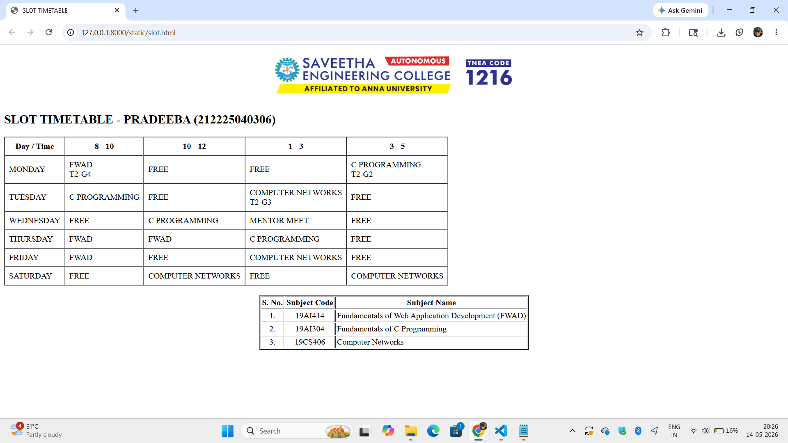

# Ex02 Time Table
## Date:

## AIM
To write a html webpage page to display your slot timetable.

## ALGORITHM
### STEP 1
Create a Django-admin Interface.

### STEP 2
Create a static folder and inert HTML code.

### STEP 3
Create a simple table using ```<table>``` tag in html.

### STEP 4
Add header row using ```<th>``` tag.

### STEP 5
Add your timetable using ```<td>``` tag.

### STEP 6
Execute the program using runserver command.

# Ex02 Time Table

## PROGRAM

```html
<!DOCTYPE html>
<html>
<head>
  <title>SLOT TIMETABLE</title>
</head>
<body>

<center>
    
</center>

<h2>SLOT TIMETABLE - PRADEEBA (212225040306)</h2>

<table border="1" cellpadding="8" cellspacing="0">

<tr>
    <th>Day / Time</th>
    <th>8 - 10</th>
    <th>10 - 12</th>
    <th>1 - 3</th>
    <th>3 - 5</th>
</tr>

<tr>
    <td>MONDAY</td>
    <td>FWAD<br>T2-G4</td>
    <td>FREE</td>
    <td>FREE</td>
    <td>C PROGRAMMING<br>T2-G2</td>
</tr>

<tr>
    <td>TUESDAY</td>
    <td>C PROGRAMMING</td>
    <td>FREE</td>
    <td>COMPUTER NETWORKS<br>T2-G3</td>
    <td>FREE</td>
</tr>

<tr>
    <td>WEDNESDAY</td>
    <td>FREE</td>
    <td>C PROGRAMMING</td>
    <td>MENTOR MEET</td>
    <td>FREE</td>
</tr>

<tr>
    <td>THURSDAY</td>
    <td>FWAD</td>
    <td>FWAD</td>
    <td>C PROGRAMMING</td>
    <td>FREE</td>
</tr>

<tr>
    <td>FRIDAY</td>
    <td>FWAD</td>
    <td>FREE</td>
    <td>COMPUTER NETWORKS</td>
    <td>FREE</td>
</tr>

<tr>
    <td>SATURDAY</td>
    <td>FREE</td>
    <td>COMPUTER NETWORKS</td>
    <td>FREE</td>
    <td>COMPUTER NETWORKS</td>
</tr>

</table>

<br>

<table align="center" cellspacing="2" cellpadding="2" border="2">

<tr align="center">
    <th>S. No.</th>
    <th>Subject Code</th>
    <th>Subject Name</th>
</tr>

<tr>
    <td align="center">1.</td>
    <td align="center">19AI414</td>
    <td>Fundamentals of Web Application Development (FWAD)</td>
</tr>

<tr>
    <td align="center">2.</td>
    <td align="center">19AI304</td>
    <td>Fundamentals of C Programming</td>
</tr>

<tr>
    <td align="center">3.</td>
    <td align="center">19CS406</td>
    <td>Computer Networks</td>
</tr>

</table>

</body>
</html>
```

## OUTPUT



## RESULT

The program for creating slot timetable using basic HTML tags is executed successfully.
